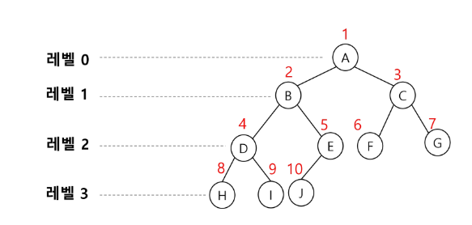

# Tree
---

## Tree?
**정의**
- 한 개 이상의 노드로 이루어진 유한 집합
- 노드 중 최상위 노드를 루트라 한다
- 나머지 노드들은 n개의 분리집합 T1, ..., TN으로 분리될 수 있다.
- T1,..., TN은 각각 하나의 트리가 되며 루트의 서브 트리라 한다.

**용어정리**
- 노드 : 트리의 원소
- 간선 : 노드를 연결하는 선으로 부모 노드와 자식 노드를 연결
- 루트 노드 : 트리의 시작 노드
- 형제 노드 : 같은 부모 노드의 자식 노드들
- 조상 노드 : 간선을 따라 루트 노드까지 이르는 경로에 있는 모든 노드들
- 서브 트리 : 부모 노드와 연결된 간선을 끊었을 때 생성되는 트리
- 자손 노드 : 서브 트리에 있는하위 레벨의 노드들
- 노드의 차수 : 노드에 연결된 자식 노드의 수
- 트리의 차수 : 트리에 있는 노드의 차수 중 가장 큰 값
- 단말 노드 : 차수가 0인 노드, 자식 노드가 없는 노드
- 노드의 높이 : 루트에서 노드에 이르는 간선의 수, 노드의 레벨
- 트리의 높이 : 트리에 있는 노드의 높이 중에서 가장 큰 값, 최대 레벨

## 이진트리
- 모든 노드들이 2개의 서브트리를 갖는 특별한 형태의 트리
- 각 노드가 자식 노드를 최대한 2개 까지만 가질 수 있는 트리
    - 왼쪽 자식, 오른쪽 자식

- 레벨 i에서의 노드의 최대 개수는 $2^i$개
- 높이가 h인 이진 트리가 가질 수 있는 노드의 최소 개수는 h+1개가 되며, 최대 개수는 $2^{h+1}-1$개가 된다.

## 포화 이진 트리
- 모든 레벨에 노드가 포화상태로 차 있는 이진 트리
- 높이가 h일 때, 최대의 노드 개수인 $2^{h+1}-1$의 노드를 가진 이진 트리
- 루트를 1번으로 하여 $2^{h+1}-1$까지 정해진 위치에 대한 노드 번호를 가짐

## 완전 이진 트리
- 높이가 h이고 노드 수가 n일 때 포화 이진 트리의 노드 번호 1번부터 n번까지 빈 자리가 없는 이진 트리
    - (단, $h+1 \leq n < 2^{h+1}-1$)

## 편향 이진 트리
- 높이 h에 대한 최소 개수의 노드를 가지면서 한쪽 방향의 자식 노드만을 가진 이진 트리

## 이진트리 순회
- 순회란 트리의 각 노드를 중복되지 않게 전부 방문 하는 것을 말함
- 3가지의 기본적인 순회 방법이 존재

- 전위 순회 : 부모노드 방문 후, 자식노드를 좌, 우 순서로 방문
    ```python
    def preorder(T):
        if T:
            visit(T)    # print(T.item)
            preorder_traverse(T.left)
            preorder_traverse(T.right)
    ```

- 중위 순회 : 왼쪽 자식노드, 부모노드, 오른쪽 자식노드 순으로 방문
    ```python
    def inorder(T):
        if T:
            inorder_traverse(T.left)
            visit(T)
            inorder_traverse(T.right)
    ```
- 후위 순회 : 자식노드를 좌, 우 순서로 방문한 후, 부모노드로 방문
    ```python
    def postorder(T):
        if T:
            postorder_traverse(T.left)
            postorder_traverse(T.right)
            visit(T)
    ```

## 이진트리의 표현

**배열을 이용한 이진 트리의 표현**
- 이진 트리에 각 노드 번호를 다음과 같이 부여
- 루트의 번호를 1로 함
- 레벨 n에 있는 노드에 대해 왼쪽부터 오른쪽으로 $2^{n}$부터 $2^{n+1}-1$까지 번호를 차례로 부여
 
