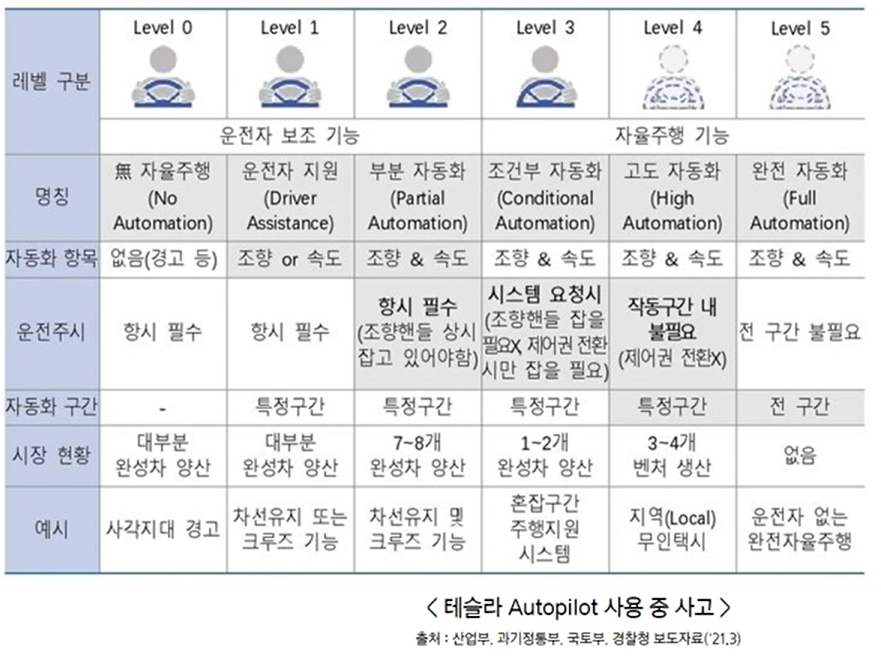

# 사전학습 1강

## 자율주행 자동화의 단계적 구분

## 현재 자율주행 단계는 2~3단계 수준

# 자율주행 3단계 핵심기술

# 1. 인지

- 경로탐색(디지털 지도)
- V2X(차량 간 통신, 인프라 통신)
- ADAS센서(카메라, 레이더, 라이다)
- 고정지물 인식 및 경로탐색(차로, 차선, 횡단보도, 터널 등)
- 변동지물 및 이동물체 인식(차량, 보행자, 신호등 등)

## Object Detection

- 이미지가 입력으로 들어오면 해당 이미지에 객체를 인식하고 분류하는 기술
- 딥러닝을 이용 SSD, YOLO, Faster R-CNN

## 정밀도로 지도

- 자율주행 등에 필요한 정보를 3차원으로 제작한 전자 지도
    - 차선, 도로시설, 표지시설
- 해상도 0.25m 급

## 정밀도로 지도의 종류

- PointCloud Map

- HD Map
- Grid Map

## 인지에 사용되는 센서

- 카메라
    - 다양한 정보 수집 가능(차선, 표지판, 신호등)
    - 객체 인식을 위해선 연산이 필요
    - 날씨에 영향을 크게 받음
- 라이다
    - 레이저를 매개체로 사물간 거리 및 형태 파악
    - 정밀하지만 비싸고 외부 환경에 영향을 많이 받음
    - 최근 라이다 센서 발전으로 자율주행에 사용되는 비중이 커짐
- 레이더
    - 전파를 매개체로 사물간 거리 및 형태를 파악
    - 라이다보다 정확도는 떨어지지만, 소형화가 가능하고 저렴함
    - 날씨에 크게 영향을 받지 않

# 2. 판단

- 주행상황 판단 및 주행전략 결정(차선변경 및 추월, 회전, 정차 등)
- 주행경로 생성(목표괘적, 목표속도, 전방타깃 등)

## 경로계획

- 차량이 장애물을 회피하면서 목표지점까지 최적의 경로로 도달하게 하는 기술
- 전역 경로 계획
    - 지도에 기반하여 경로를 자율적으로 생성
    - 주행 기록을 이용한 전역 경로 생성
        
        
- 지역 경로 계획
    - 지도 정보로부터 나와있지 않은 예기치 못한 장애물이나 움직이는 장애물에 대해 여러 센서를 이용하여 장애물을 피해가며 경로를 재생성

- 경로 생성 - 궤적
    - 차선변경이나 경로를 변경하기 위한 궤적 필요
    - 궤적을 만들 때 가장 쉬운 방법은 시작과 끝을 잇는 방법
    - 하지만 각도의 변화가 시작부분과 끝부분에서 너무 큼
    - 3차함수를 이용하여 매 순간 각도의 변화량을 주어 시작점과 끝점에서 큰 각도변화를 피할 수 있음
    
- 경로 추종
    - 대표적인 방법으로 Pure pursuit guidance
        - [https://en.wikipedia.org/wiki/Pursuit_guidance](https://en.wikipedia.org/wiki/Pursuit_guidance) 참
        - 경로 위의 한 점을 원 호를 그리며 경로를 추종하는 알고리즘
        

# 3. 제어

- 차량제어(목표 조향각/토크, 목표 가감속)
- 엔진가감속, 조향

## 속도 제어

- 제어인식 및 판단 결과에 따른 자율주행 시스템의 작동
    - 인식 및 판단 결과에 따른 자율주행 시스템의 작동
    - 실제 차를 어떻게 움직일지 구동계와 조향계에 명령
- PID 제어
    - 비례 - 적분 - 미분 제어
    - 내 차량의 상태와 목표 차량의 상태와의 오차 값을 이용해 제어값 계산
        - 비례항 : 현재 상태에서의 오차 값의 크기에 비례한 제어작용
            
            → 오차값이 크면 제어 값도 커짐 !
            
        - 적분항 : 정상상태에서의 오차를 없애는 작용
            
            → 내 차량의 상태의 평균값을 목표 차량의 상태로 만드는 과정
            
        - 미분항 : 출력값의 급격한 변화에 제동을 걸어 오버슛을 줄이고 안정성을 향상
            
            → 요요현상(?) 같은 진동폭을 줄이기 위한