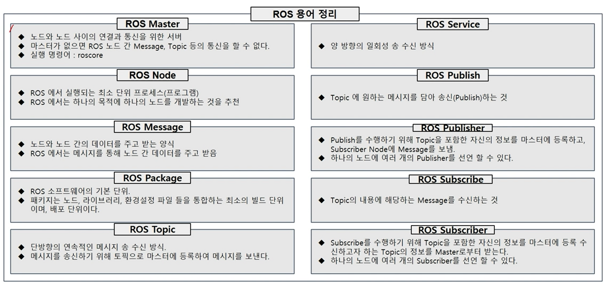

# 사전학습 2, 3강

# 센서 이론

## 센서 소개

1. 자율주행 센서
    1. 카메라
    2. 라이다
    3. 레이더
    4. GPS
    5. IMU
    

> 카메라, 라이다, 레이더는 인지센서이며, GPS. IMU는 Localization 센서로 인지 수행에 도움이 되므로 인지센서라 할 수도 있음
> 

# ROS

- Robot Operating System
- 로봇을 개발하는데 있어 필수적인 라이브러리 제공
- ROS wiki에 많은 정보가 나와있음
- 노드간 통신을 기반으로 전체 시스템 구동
- 메시지 기록 재생 기능으로 반복적인 실험 가능, 알고리즘 개발에 용이
- Rvix
    - 센서 데이터 등의 데이터 시각화 도구
- RQT
    - QT기반 GUI 응용 개발 도구

- ROS Master
    - 노드와 노드 사이의 연결과 통신을 위한 서버
- ROS Node
    - ROS에서 실행되는 최소 단위 프로세스
    - ROS에서는 하나의 목적에 하나의 노드를 개발하는 것을 추천!
- ROS Message
    - 노드와 노드 간의 데이터를 주고 받는 양식
- ROS Package
    - ROS 소프트웨어의 기본 단위
    - ex) 전기포트 제어 패키지
- ROS Topic
    - 단방향의 연속적인 메시지 송 수신 방식
    - 비동기 통신
- ROS Service
    - 양방향의 **일회성** 송 수신 방식
    - 동기 통
- ROS Publish
    - Topic에 원하는 메시지를 담아 송신하는 것
- ROS Publisher
    - 노드가 Publish를 수행하기 위해 Topic을 포함한 자신의 정보를 마스터에 등록하고, Subscriber Node에 Message를 보내는
    - 하나의 노드에 여러 개의 Publisher를 선언 할 수 있다.
- ROS Subscribe
    - Topic의 내용에 해당하는 Message를 수신하는 것
- ROS Subscriber
    - Subscribe를 수행하기 위해 Topic을 포함한 자신의 정보를 마스터에 등록 수신하고자 하는 Topic의 정보를 Master로부터 받는 역할
    

## ROS 용어 정리

- roscd package
    - 터미널의 현재 위치와 상관없이 해당 패키지 디렉토리로 이동하는 명령어
- 

- rosrun package
    - 터미널의 현재 위치와 상관없이 해당 패키지를 실행시키는 명령어
- rosbridge
    - 로스 연결을 위한 명령

